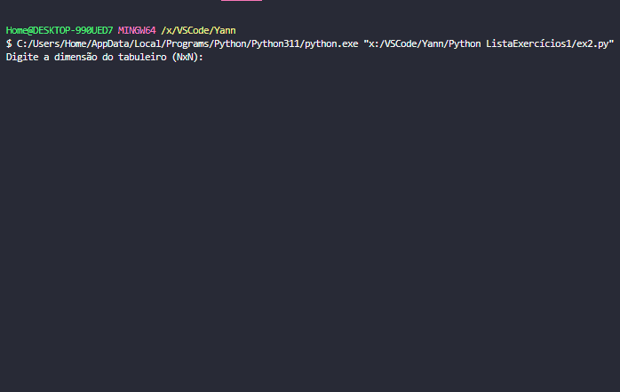

# Lista de Exercicios Python
Aluno: Yann Lucas Saito da Luz

## ex1.py
1. Crie uma versão do jogo da velha 4x4. As regras são as mesmas da versão 3x3.

Jogo da Velha em Python

Implementação básica de uma jogo da velha 4x4, seguindo as mesmas regras da versão 3x3. Ele permite que os dois jogadores joguem alternadamente até que um deles vença ou de velha.

Estratégia:
- O tabuleiro é representado como uma lista 4x4.
- Os jogadores são representados por 'X' e 'O'.

Detalhamento das estruturas usadas:
- A função `imprime_tabuleiro()` exibe o estado atual do tabuleiro.
- A função `ganhou()` verifica se algum jogador venceu o jogo.
- A função `empate()` verifica se o jogo terminou em empate.
- A função `jogar()` é a função principal que controla o fluxo do jogo.

Instruções de uso:
- Execute este arquivo para começar o jogo.
- Os jogadores digitam as coordenadas para fazer suas jogadas.
- As coordenadas vão de 1 a 4
##### EXEMPLO:

## ex2.py
2. Crie um jogo da velha NxN em que o usuário deve definir as dimensões do tabuleiro (sempre
quadrado).

Jogo da Velha - Implementação em Python

Este é um programa que implementa o jogo da velha em um tabuleiro NxN, onde N é definido pelo usuário.
Os jogadores são representados por 'X' (vermelho) e 'O' (azul). O jogo verifica se há um vencedor ou empate
e imprime o resultado final.

Estratégia:
- O programa usa uma matriz para representar o tabuleiro do jogo.
- Ele permite que os jogadores 'X' e 'O' façam suas jogadas alternadamente.
- Verifica se um jogador ganhou através de linhas, colunas e diagonais.
- Verifica se o jogo terminou em empate quando todas as casas estiverem preenchidas.
- Limpa a tela do console para uma melhor experiência de jogo.
- Para que os jogadores façam suas jogadas ele segue a mesma lógica do ex1.py

Detalhamento das estruturas usadas:
- `tabuleiro`: Uma matriz NxN que representa o tabuleiro do jogo.
- `jogador`: Uma variável que alterna entre 'X' e 'O' para representar o jogador atual.
- `imprime_tabuleiro()`: Função que imprime o tabuleiro com cores para 'X' e 'O'.
- `limpar_tela()`: Função que limpa a tela do console.
- `ganhou()`: Função que verifica se um jogador ganhou.
- `empatou()`: Função que verifica se o jogo terminou em empate.
- `main()`: Função principal que inicia o jogo, gerencia as jogadas e imprime o resultado.
##### EXEMPLO:

## ex3.py
## ex4.py
