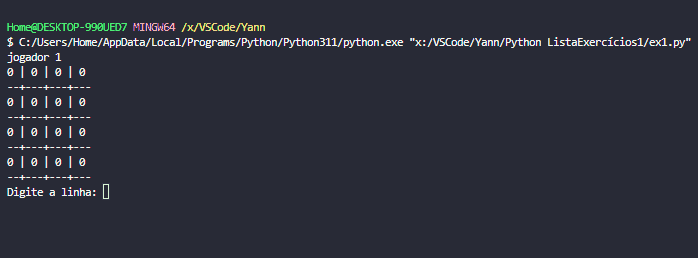

# Lista de Exercicios Python
Aluno: Yann Lucas Saito da Luz

## ex1.py
1. Crie uma versão do jogo da velha 4x4. As regras são as mesmas da versão 3x3.

Jogo da Velha em Python

Implementação básica de uma jogo da velha 4x4, seguindo as mesmas regras da versão 3x3. Ele permite que os dois jogadores joguem alternadamente até que um deles vença ou de velha.

Estratégia:
- O tabuleiro é representado como uma lista 4x4.
- Os jogadores são representados por 'X' e 'O'.
- A função `imprime_tabuleiro` exibe o estado atual do tabuleiro.
- A função `ganhou` verifica se algum jogador venceu o jogo.
- A função `empate` verifica se o jogo terminou em empate.
- A função `jogar` é a função principal que controla o fluxo do jogo.

Instruções de uso:
- Execute este arquivo para começar o jogo.
- Os jogadores digitam as coordenadas para fazer suas jogadas.
- As coordenadas vão de 1 a 4
##### EXEMPLO:

## ex2.py
## ex3.py
## ex4.py
