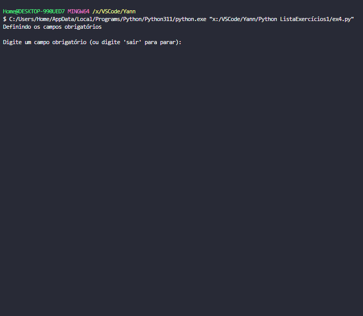

# Lista de Exercicios Python
Aluno: Yann Lucas Saito da Luz
  
## ex1.py
1. Crie uma versão do jogo da velha 4x4. As regras são as mesmas da versão 3x3.

Jogo da Velha em Python
<a href="ex1.py">ex1.py</a>
  
Implementação básica de uma jogo da velha 4x4, seguindo as mesmas regras da versão 3x3. Ele permite que os dois jogadores joguem alternadamente até que um deles vença ou de velha.

#### Estratégia:
-------------------
- O tabuleiro é representado como uma lista 4x4.
- Os jogadores são representados por 'X' e 'O'.

#### Detalhamento das estruturas usadas:
-------------------
- A função `imprime_tabuleiro()` exibe o estado atual do tabuleiro.
- A função `ganhou()` verifica se algum jogador venceu o jogo.
- A função `empate()` verifica se o jogo terminou em empate.
- A função `jogar()` é a função principal que controla o fluxo do jogo.

#### Instruções de uso:
-------------------
- Execute este arquivo para começar o jogo.
- Os jogadores digitam as coordenadas para fazer suas jogadas.
- As coordenadas vão de 1 a 4
##### EXEMPLO:

## ex2.py
2. Crie um jogo da velha NxN em que o usuário deve definir as dimensões do tabuleiro (sempre
quadrado).

Jogo da Velha - Implementação em Python
<a href="ex2.py">ex2.py</a>
  
Este é um programa que implementa o jogo da velha em um tabuleiro NxN, onde N é definido pelo usuário.
Os jogadores são representados por 'X' (vermelho) e 'O' (azul). O jogo verifica se há um vencedor ou empate
e imprime o resultado final.

#### Estratégia:
-------------------
- O programa usa uma matriz para representar o tabuleiro do jogo.
- Ele permite que os jogadores 'X' e 'O' façam suas jogadas alternadamente.
- Verifica se um jogador ganhou através de linhas, colunas e diagonais.
- Verifica se o jogo terminou em empate quando todas as casas estiverem preenchidas.
- Limpa a tela do console para uma melhor experiência de jogo.
- Para que os jogadores façam suas jogadas ele segue a mesma lógica do ex1.py

#### Detalhamento das estruturas usadas:
-------------------
- `tabuleiro`: Uma matriz NxN que representa o tabuleiro do jogo.
- `jogador`: Uma variável que alterna entre 'X' e 'O' para representar o jogador atual.
- `imprime_tabuleiro()`: Função que imprime o tabuleiro com cores para 'X' e 'O'.
- `limpar_tela()`: Função que limpa a tela do console.
- `ganhou()`: Função que verifica se um jogador ganhou.
- `empatou()`: Função que verifica se o jogo terminou em empate.
- `main()`: Função principal que inicia o jogo, gerencia as jogadas e imprime o resultado.

#### EXEMPLO:
-------------------

## ex3.py
3. Desenvolver o jogo https://term.ooo/ a partir do arquivo lista_palavras.txt. O jogo deve ser
jogado por meio do terminal, mantendo a lógica do jogo original. Devem aparecer as letras que
já foram descobertas, as letras já tentadas no teclado e assim por diante. Atente-se à
formatação.

Jogo Termoo
<a href="ex3.py">ex3.py</a>
  
Este é um jogo de adivinhação de palavras. O jogador tem um número limitado de tentativas para adivinhar a palavra secreta.

#### Estratégia:
-------------------
- O programa escolhe aleatoriamente uma palavra secreta com base no tamanho especificado.
- O jogador digita palpites até zerar suas tentativas ou adivinhar a palavra secreta.
- O programa fornece um feedback visual sobre os palpites do jogador, destacando letras corretas no lugar certo, letras corretas no lugar errado e letras erradas.
- O jogo continua até que o jogador adivinhe a palavra secreta ou esgote suas tentativas.

#### Detalhamento das Estruturas:
-------------------
- `MAX_TENTATIVAS`: Define o número máximo de tentativas permitidas.
- `teclado`: Uma matriz que representa o layout do teclado.
- `teclas_usadas`: Uma lista para armazenar letras já usadas.
- `letras_lugar_certo`: Uma lista para armazenar letras corretas no lugar certo.
- `letras_certas`: Uma lista para armazenar letras corretas no lugar errado.
- `letras_palavra`: Uma lista para armazenar as letras da palavra secreta.
- `emojis`: Dicionário que mapeia os emojis usados no jogo.
- `imprime_teclado()`: Imprime o layout do teclado com formatação de cores.
- `remove_letras_usadas()`: Adiciona letras das palavras usadas à lista de teclas usadas.
- `escolhe_palavra()`: Escolhe aleatoriamente uma palavra secreta do arquivo "lista_palavras.txt" com base no tamanho especificado.
- `numero_letras()`: Filtra as palavras de acordo com o tamanho especificado.
- `lugar_certo()`: Armazena a letra em `letras_lugar_certo`.
- `letra_certa()`: Armazena a letra em `letras_certas`.
- `errado()`: Armazena a letra em `teclas_usadas`.
- `pontos_chute()`: Calcula e formata os pontos e emojis com base no chute do jogador.
- `recebe_chute()`: Recebe e processa o chute do jogador.
- `jogar()`: Função principal do jogo para controlar o fluxo do jogo.
  
#### EXEMPLO:
-------------------

## ex4.p
4. Prática de dicionários

  
Este programa permite o cadastro e impressão de informações de usuários.
O programa tem a capacidade de definir campos obrigatórios e campos adicionais, além de opções de filtragem
para imprimir os dados dos usuários de acordo com critérios específicos.
<a href="ex4.py">ex4.py</a>
  
#### Estratégia:
-------------------
O programa utiliza um dicionário chamado "banco_usuarios" para armazenar os dados dos usuários, onde a chave é
o nome do usuário. Ele oferece um menu principal com as opções de cadastrar usuário, imprimir usuários e sair do
programa. Também permite definir campos obrigatórios que cada usuário deve ter. Além disso, oferece um menu de
impressão com opções para filtrar os usuários com base no nome, campos e valores.

#### Detalhamento das Estruturas Usadas:
-------------------
- Dicionário `banco_usuarios()`: Armazena os dados dos usuários com o nome como chave.
- Lista `campos_obrigatorios`: Armazena os campos obrigatórios definidos pelo usuário.
- `menu()`: Menu principal do programa que apresenta as opções de cadastras ou imprimir usuários e a opção de sair do programa
- `menu_imprimir_usuario()`: Menu de impressão dos usuários, com direito a filtros como nome, campos e valores
- `definir_campos_obrigatorios()`: Permite que o usuário defina os campos obrigatórios para cadastrar usuários
- `cadastrar_usuario()`: Permite cadastrar um novo usuário com os campos obrigatórios e com campos adicionais
- `imprimir_usuarios()`: Possibilita imprimir as informações dos usuários com diversas opções de filtragem
- `main()`: Controla o fluxo do programa.
- Estruturas de controle "if", "while" e "try...except" para interagir com o usuário e tomar decisões.

#### EXEMPLO:
-------------------

